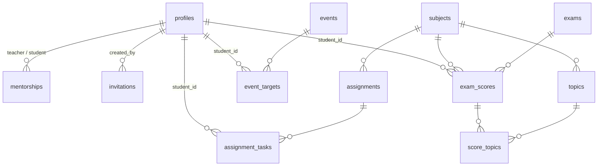

# 技術設計書 — データモデル・RLS・認証(ドラフト v0.1)

| 項目 | 内容 |
|---|---|
| 対象 | [要件定義書 v1.0](requirements.md) §7 の概念モデルの具体化 |
| 前提 | [レビュー文書](requirements-review.md) の推奨案(2-1, A-2, A-3, A-4, B-1, B-4)を採用した形で記述。レビュー会議で別の決定が出た場合の影響は §9 参照 |
| スタック | Supabase(PostgreSQL + Auth + RLS)/ Next.js / Vercel |
| ステータス | ドラフト。要件定義書 v1.1 確定後にマイグレーションとして実装 |

---

## 1. アーキテクチャ概要

```
[生徒・講師・運営のブラウザ(スマホ中心)]
        │ HTTPS
        ▼
[Next.js (Vercel)] ──────────────► [Discord Webhook](F-5 通知)
        │ supabase-js(anon key + ユーザーJWT)
        ▼
[Supabase]
  ├─ Auth(Discord OAuth / メール)
  ├─ PostgreSQL + RLS  ← 権限制御の本丸(NF-5)
  └─ Edge Function(招待の検証、Webhook 送信)
```

設計の柱は **「権限制御はすべて DB 層(RLS)で完結させる」**。Next.js 側のバグや実装漏れがあっても、他生徒の成績が返らない構造にする(NF-5)。アプリ層の権限チェックは UX のため(ボタンの出し分け)であり、セキュリティ境界ではない。

---

## 2. ER 図



概念モデル(§7)からの主な具体化:

- `users` → `profiles`(Supabase の `auth.users` と 1:1。認証情報は Auth に委譲し、アプリ側は表示名・ロール等のみ持つ → F-4-6)
- `subjects` / `topics` をマスタとして新設(表記ゆれ対策。レビュー A-2)
- `mentorships` に期間(開始・終了)を追加し N:N を明示(レビュー A-3, A-4)
- `exam_scores` に `registered_by` を追加(レビュー 2-1)
- `invitations` を新設(F-4-4 招待制)

---

## 3. テーブル定義(DDL)

そのままマイグレーション(`supabase/migrations/0001_initial_schema.sql`)に転記できる形で記す。

### 3.1 列挙型

```sql
create type user_role        as enum ('student', 'teacher', 'admin');   -- 生徒・講師・運営
create type user_status      as enum ('active', 'inactive');
create type task_status      as enum ('not_started', 'in_progress', 'done');  -- F-1-4 の3状態
create type exam_type        as enum ('mock', 'term', 'quiz');          -- 模試・定期・小テスト
create type event_type       as enum ('mock_exam', 'offline', 'other');
create type event_visibility as enum ('all', 'targeted');               -- F-3-4
```

### 3.2 ユーザー・担当関係・招待

```sql
-- ユーザー(auth.users と 1:1)
create table profiles (
  id           uuid primary key references auth.users (id) on delete cascade,
  display_name text not null,
  role         user_role not null,
  grade        text,                          -- 学年(例: 高2)。進級は運営が手動更新(レビュー B-3)
  affiliation  text,                          -- 所属(任意)
  status       user_status not null default 'active',
  created_at   timestamptz not null default now()
);

-- 担当関係(N:N + 期間。レビュー A-3, A-4)
create table mentorships (
  id         uuid primary key default gen_random_uuid(),
  teacher_id uuid not null references profiles (id),
  student_id uuid not null references profiles (id),
  started_on date not null default current_date,
  ended_on   date,                            -- null = 現担当
  check (teacher_id <> student_id)
);
-- 同一ペアの「現担当」は1件まで
create unique index mentorships_active_uniq
  on mentorships (teacher_id, student_id) where ended_on is null;

-- 招待(F-4-4。運営が発行、72時間・1回限り)
create table invitations (
  id         uuid primary key default gen_random_uuid(),
  token      uuid not null unique default gen_random_uuid(),
  role       user_role not null,
  grade      text,
  mentor_id  uuid references profiles (id),   -- 生徒招待時に担当講師を事前指定(レビュー 2-3)
  created_by uuid not null references profiles (id),
  expires_at timestamptz not null default now() + interval '72 hours',
  used_by    uuid references profiles (id),
  used_at    timestamptz,
  created_at timestamptz not null default now()
);
```

### 3.3 科目・分野マスタ(レビュー A-2)

```sql
create table subjects (
  id         uuid primary key default gen_random_uuid(),
  name       text not null unique,            -- 例: 数学I・A
  sort_order int not null default 0,
  is_active  boolean not null default true    -- 廃止は論理削除(成績が参照しているため)
);

create table topics (
  id         uuid primary key default gen_random_uuid(),
  subject_id uuid not null references subjects (id),
  name       text not null,                   -- 例: 二次関数
  unique (subject_id, name)
);
```

初期データ(例。v1.1 の付録で確定したリストを投入する):

```sql
insert into subjects (name, sort_order) values
  ('英語', 10), ('数学I・A', 20), ('数学II・B', 21),
  ('現代文', 30), ('古典', 31),
  ('物理', 40), ('化学', 41), ('生物', 42),
  ('地理', 50), ('歴史', 51), ('公民', 52);
```

### 3.4 課題・タスク(F-1)

```sql
create table assignments (
  id         uuid primary key default gen_random_uuid(),
  created_by uuid not null references profiles (id),
  title      text not null,
  description text,
  subject_id uuid references subjects (id),
  due_date   date not null,
  created_at timestamptz not null default now()
);

create table assignment_tasks (
  id            uuid primary key default gen_random_uuid(),
  assignment_id uuid not null references assignments (id) on delete cascade,
  student_id    uuid not null references profiles (id),
  status        task_status not null default 'not_started',
  progress_note text,                         -- F-1-7(自由記述メモ)
  completed_at  timestamptz,                  -- トリガーが status から自動設定
  updated_at    timestamptz not null default now(),
  unique (assignment_id, student_id)          -- F-1-2: 1課題×1生徒 = 1タスク
);

-- completed_at と updated_at の自動管理(生徒の入力は status の1タップだけで完結 → P-4)
create or replace function set_task_timestamps() returns trigger
language plpgsql as $$
begin
  new.updated_at := now();
  if new.status = 'done' and old.status is distinct from 'done' then
    new.completed_at := now();
  elsif new.status <> 'done' then
    new.completed_at := null;
  end if;
  return new;
end $$;

create trigger assignment_tasks_timestamps
  before update on assignment_tasks
  for each row execute function set_task_timestamps();
```

### 3.5 テスト・成績(F-2)

```sql
create table exams (
  id         uuid primary key default gen_random_uuid(),
  name       text not null,
  exam_date  date not null,
  type       exam_type not null,
  provider   text,                            -- 模試の提供元(任意。レビュー B-1)
  created_by uuid not null references profiles (id)
);

create table exam_scores (
  id            uuid primary key default gen_random_uuid(),
  exam_id       uuid not null references exams (id) on delete cascade,
  student_id    uuid not null references profiles (id),
  subject_id    uuid not null references subjects (id),
  score         numeric not null check (score >= 0),
  max_score     numeric not null check (max_score > 0),
  deviation     numeric,                      -- 偏差値(任意)
  judgement     text check (judgement in ('A','B','C','D','E')),  -- F-2-7(任意)
  note          text,                         -- F-2-9 振り返りメモ
  registered_by uuid not null references profiles (id),  -- レビュー 2-1
  created_at    timestamptz not null default now(),
  unique (exam_id, student_id, subject_id),
  check (score <= max_score)
);

-- 分野タグ別得点(F-2-8。Phase 2 の布石)
create table score_topics (
  id            uuid primary key default gen_random_uuid(),
  exam_score_id uuid not null references exam_scores (id) on delete cascade,
  topic_id      uuid not null references topics (id),
  score         numeric not null check (score >= 0),
  max_score     numeric not null check (max_score > 0),
  unique (exam_score_id, topic_id)
);
```

### 3.6 予定(F-3)

```sql
create table events (
  id         uuid primary key default gen_random_uuid(),
  title      text not null,
  starts_at  timestamptz not null,
  ends_at    timestamptz,
  type       event_type not null default 'other',
  visibility event_visibility not null default 'all',
  created_by uuid not null references profiles (id),
  created_at timestamptz not null default now()
);

-- visibility = 'targeted' のときの対象生徒(F-3-4)
create table event_targets (
  event_id   uuid not null references events (id) on delete cascade,
  student_id uuid not null references profiles (id),
  primary key (event_id, student_id)
);
```

### 3.7 インデックス

主キー・unique 制約以外で必要なもの。数十名規模(P-5)なので最小限。

```sql
create index on mentorships (student_id) where ended_on is null;
create index on assignment_tasks (student_id, status);
create index on assignments (due_date);
create index on exam_scores (student_id, subject_id);
create index on events (starts_at);
```

---

## 4. RLS(Row Level Security)設計

### 4.1 ヘルパー関数

ポリシー内で繰り返す判定を関数化する。`security definer` で定義し(関数内の参照は RLS を通らないため再帰しない)、`search_path` を固定する。

```sql
create schema if not exists app;

-- 自分のロール(無効ユーザーは null → 全ポリシーで弾かれる)
create or replace function app.my_role() returns user_role
language sql stable security definer set search_path = public as $$
  select role from profiles where id = auth.uid() and status = 'active';
$$;

create or replace function app.is_admin() returns boolean
language sql stable security definer set search_path = public as $$
  select app.my_role() = 'admin';
$$;

create or replace function app.is_staff() returns boolean  -- 講師または運営
language sql stable security definer set search_path = public as $$
  select app.my_role() in ('teacher', 'admin');
$$;

-- 自分(講師)が当該生徒の「現担当」か(レビュー A-3: 現担当は過去履歴も閲覧可)
create or replace function app.is_mentor_of(p_student uuid) returns boolean
language sql stable security definer set search_path = public as $$
  select exists (
    select 1 from mentorships
    where teacher_id = auth.uid() and student_id = p_student and ended_on is null
  );
$$;
```

### 4.2 権限マトリクス(設計の要約)

| テーブル | 生徒 | 講師 | 運営 |
|---|---|---|---|
| profiles | 自分 + 講師・運営の表示名 | 左記 + 担当生徒 | 全件・全操作 |
| mentorships | 自分の行(閲覧) | 自分の行(閲覧) | 全操作 |
| invitations | — | — | 全操作 |
| subjects / topics | 閲覧 | 閲覧 + topics 追加 | 全操作 |
| assignments | 自分に割当のあるもの(閲覧) | 作成・自作の更新削除 + 担当生徒分の閲覧 | 全件 |
| assignment_tasks | 自分の行:閲覧 + status/メモ更新 | 担当生徒分:閲覧 / 自作課題分:作成・削除 | 全件 |
| exams | 閲覧・作成 | 閲覧・作成・自作の修正 | 全件 |
| exam_scores | **自分の行のみ**:閲覧・登録・修正 | 担当生徒分:閲覧・登録・修正 | 全件 |
| score_topics | exam_scores に追従 | exam_scores に追従 | 全件 |
| events | 全体公開 + 自分宛て(閲覧) | 閲覧 + 作成・自作の更新削除 | 全操作 |

太字が NF-5 / F-2-6 の核心:**生徒の成績は本人・現担当講師・運営以外には DB 層で不可視**。

### 4.3 ポリシー定義(SQL)

```sql
-- ===== profiles =====
alter table profiles enable row level security;

create policy profiles_select on profiles for select using (
  id = auth.uid()                                   -- 自分
  or app.is_admin()                                 -- 運営は全件
  or app.is_mentor_of(id)                           -- 講師は担当生徒
  or (role in ('teacher','admin') and app.my_role() is not null)
     -- 講師・運営の表示名は全員に可視(課題作成者名・担当講師名の表示に必要)
);

create policy profiles_update_own on profiles for update
  using (id = auth.uid()) with check (id = auth.uid());
create policy profiles_admin_write on profiles for all
  using (app.is_admin()) with check (app.is_admin());
-- insert は招待の引換関数(§5)と運営のみ。本人 update で role/status を
-- 変えられないよう、列レベル権限で防ぐ:
revoke update on profiles from authenticated;
grant  update (display_name, grade, affiliation) on profiles to authenticated;

-- ===== mentorships =====
alter table mentorships enable row level security;
create policy mentorships_select on mentorships for select using (
  teacher_id = auth.uid() or student_id = auth.uid() or app.is_admin()
);
create policy mentorships_admin_write on mentorships for all
  using (app.is_admin()) with check (app.is_admin());

-- ===== invitations =====
alter table invitations enable row level security;
create policy invitations_admin on invitations for all
  using (app.is_admin()) with check (app.is_admin());
-- 招待の引換は security definer 関数経由(本人は invitations を直接読めない)

-- ===== subjects / topics =====
alter table subjects enable row level security;
alter table topics  enable row level security;
create policy subjects_select on subjects for select using (app.my_role() is not null);
create policy subjects_admin  on subjects for all
  using (app.is_admin()) with check (app.is_admin());
create policy topics_select on topics for select using (app.my_role() is not null);
create policy topics_staff_insert on topics for insert with check (app.is_staff());
create policy topics_admin on topics for all
  using (app.is_admin()) with check (app.is_admin());

-- ===== assignments =====
alter table assignments enable row level security;
create policy assignments_select on assignments for select using (
  app.is_admin()
  or created_by = auth.uid()
  or exists (select 1 from assignment_tasks t
             where t.assignment_id = assignments.id
               and (t.student_id = auth.uid() or app.is_mentor_of(t.student_id)))
);
create policy assignments_teacher_insert on assignments for insert
  with check (app.is_staff() and created_by = auth.uid());
create policy assignments_owner_write on assignments for update
  using (created_by = auth.uid() or app.is_admin());
create policy assignments_owner_delete on assignments for delete
  using (created_by = auth.uid() or app.is_admin());

-- ===== assignment_tasks =====
alter table assignment_tasks enable row level security;
create policy tasks_select on assignment_tasks for select using (
  student_id = auth.uid() or app.is_mentor_of(student_id) or app.is_admin()
);
create policy tasks_insert on assignment_tasks for insert with check (
  app.is_admin()
  or exists (select 1 from assignments a
             where a.id = assignment_id and a.created_by = auth.uid())
);
create policy tasks_update on assignment_tasks for update using (
  student_id = auth.uid() or app.is_mentor_of(student_id) or app.is_admin()
);
create policy tasks_delete on assignment_tasks for delete using (
  app.is_admin()
  or exists (select 1 from assignments a
             where a.id = assignment_id and a.created_by = auth.uid())
);
-- 生徒が更新できるのは status と progress_note のみ(列レベル権限):
revoke update on assignment_tasks from authenticated;
grant  update (status, progress_note) on assignment_tasks to authenticated;

-- ===== exams =====
alter table exams enable row level security;
create policy exams_select on exams for select using (app.my_role() is not null);
create policy exams_insert on exams for insert
  with check (app.my_role() is not null and created_by = auth.uid());
create policy exams_owner_write on exams for update
  using (created_by = auth.uid() or app.is_admin());
create policy exams_admin_delete on exams for delete using (app.is_admin());

-- ===== exam_scores =====  ← F-2-6 / NF-5 の核心
alter table exam_scores enable row level security;
create policy scores_select on exam_scores for select using (
  student_id = auth.uid() or app.is_mentor_of(student_id) or app.is_admin()
);
create policy scores_insert on exam_scores for insert with check (
  registered_by = auth.uid()
  and (student_id = auth.uid() or app.is_mentor_of(student_id) or app.is_admin())
);
create policy scores_update on exam_scores for update using (
  student_id = auth.uid() or app.is_mentor_of(student_id) or app.is_admin()
);
create policy scores_delete on exam_scores for delete using (
  student_id = auth.uid() or app.is_mentor_of(student_id) or app.is_admin()
);

-- ===== score_topics ===== (親の exam_scores の可視性に追従)
alter table score_topics enable row level security;
create policy score_topics_all on score_topics for all using (
  exists (select 1 from exam_scores s
          where s.id = exam_score_id
            and (s.student_id = auth.uid()
                 or app.is_mentor_of(s.student_id)
                 or app.is_admin()))
) with check (
  exists (select 1 from exam_scores s
          where s.id = exam_score_id
            and (s.student_id = auth.uid()
                 or app.is_mentor_of(s.student_id)
                 or app.is_admin()))
);

-- ===== events / event_targets =====
alter table events enable row level security;
create policy events_select on events for select using (
  app.my_role() is not null
  and (visibility = 'all'
       or app.is_staff()
       or exists (select 1 from event_targets t
                  where t.event_id = events.id and t.student_id = auth.uid()))
);
create policy events_staff_insert on events for insert
  with check (app.is_staff() and created_by = auth.uid());
create policy events_owner_write on events for update
  using (created_by = auth.uid() or app.is_admin());
create policy events_owner_delete on events for delete
  using (created_by = auth.uid() or app.is_admin());

alter table event_targets enable row level security;
create policy event_targets_select on event_targets for select using (
  student_id = auth.uid() or app.is_staff()
);
create policy event_targets_staff_write on event_targets for all
  using (app.is_staff()) with check (app.is_staff());
```

### 4.4 RLS の検証方針

権限分離は最重要要件なので、マイグレーションと同時にテストを書く。最低限のシナリオ:

1. 生徒Aで認証し、生徒Bの `exam_scores` / `assignment_tasks` / `profiles` を select → **0件**であること
2. 担当でない講師で生徒Aの成績を select → 0件。担当講師では取得できること
3. 担当終了(`ended_on` 設定)後、元担当講師から見えなくなること
4. 生徒が自分のタスクの `student_id` を update → 列権限エラーになること

---

## 5. 認証・招待フロー(F-4)

### 5.1 認証方式

レビュー [A-1] の推奨どおり **Discord OAuth を第一候補**とする(Supabase Auth の標準プロバイダ)。メール+パスワードは講師・運営向けの代替として併用可。どちらで認証しても `auth.users` に行ができるだけで、**`profiles` が無い限り RLS 上なにも見えない**(`app.my_role()` が null)。これが「野良登録不可」(F-4-4)の実体になる。

### 5.2 招待の引換

登録の正当性チェックは security definer 関数に集約する(クライアントからは `invitations` を読めない)。

```sql
create or replace function app.redeem_invitation(p_token uuid, p_display_name text)
returns void
language plpgsql security definer set search_path = public as $$
declare
  inv invitations;
begin
  select * into inv from invitations
   where token = p_token and used_at is null and expires_at > now()
   for update;
  if not found then
    raise exception 'INVALID_INVITATION';  -- 期限切れ・使用済み・不正トークン
  end if;
  if exists (select 1 from profiles where id = auth.uid()) then
    raise exception 'ALREADY_REGISTERED';
  end if;

  insert into profiles (id, display_name, role, grade)
  values (auth.uid(), p_display_name, inv.role, inv.grade);

  if inv.role = 'student' and inv.mentor_id is not null then
    insert into mentorships (teacher_id, student_id) values (inv.mentor_id, auth.uid());
  end if;

  update invitations set used_by = auth.uid(), used_at = now() where id = inv.id;
end $$;
```

フロー全体:

```
運営: 管理画面で発行(ロール・学年・担当講師を指定)
  → /invite/{token} の URL を Discord DM で本人へ
本人: URL を開く → Discord OAuth でサインイン
  → アプリが redeem_invitation(token, 表示名) を RPC 呼び出し
  → profiles + mentorships が作成され、即ホーム画面へ
```

### 5.3 退会(F-4-5 / NF-7)

- **無効化**:運営が `profiles.status = 'inactive'` に更新。`app.my_role()` が null になるため、ログインできても何も見えない(即時の利用停止)
- **削除**:運営が `auth.users` の行を削除 → `profiles` が cascade 削除。成績・タスク等の本人データはレビュー B-2 のとおり物理削除する(`exam_scores` 等の `student_id` 参照行を削除するメンテナンス関数を用意)。猶予 30 日は運用ルールとして扱う

---

## 6. カレンダーの自動反映(F-3-2)

締切を `events` に複製しない(二重入力・不整合の禁止)。閲覧者の権限で評価されるビュー(`security_invoker`)で予定と締切を合成する。

```sql
create view calendar_items
with (security_invoker = on) as
  select id, title, starts_at, type::text as item_type, 'event' as source
    from events
  union all
  select a.id,
         a.title,
         a.due_date::timestamptz,
         'assignment_due',
         'assignment'
    from assignments a;
```

`security_invoker = on` により、生徒には「全体公開・自分宛ての予定」+「自分に割り当てられた課題の締切」だけが返る(レビュー C-1 の要件を RLS がそのまま満たす)。講師は担当生徒分の締切も見える。

---

## 7. Discord 通知(F-5-1)

- `assignment_tasks` への insert を Supabase **Database Webhook** で拾い、Edge Function が Discord Webhook URL へ POST する(「○○さんに課題『△△』が割り当てられました(締切 6/20)」)
- Discord Webhook URL は Edge Function の環境変数(secret)に置き、DB・クライアントには持たせない
- 通知失敗は握りつぶしてよい(通知は補助線であり、状態の正は常にアプリ側 → P-1/P-2)
- F-5-2(締切前日リマインド)は Supabase の `pg_cron` で日次バッチ1本。MVP では未実装でよい

---

## 8. KPI の計測(§11 / レビュー B-4)

専用基盤は持たない。既存のタイムスタンプだけで全 KPI が SQL 集計できることを確認しておく。

| KPI | 集計元 |
|---|---|
| 週次アクティブ生徒率 | `auth.users.last_sign_in_at`(Supabase が自動記録) |
| 課題ステータス更新率 | `assignment_tasks.updated_at` と `assignments.due_date` の比較 |
| 成績登録の継続率 | `exam_scores.created_at` と `exams.exam_date` の差 |

例(課題ステータス更新率):

```sql
select count(*) filter (where t.status <> 'not_started'
                          or t.updated_at > t2.created_at) * 100.0 / count(*)
from assignment_tasks t
join assignments a on a.id = t.assignment_id
join lateral (select min(created_at) created_at from assignment_tasks
              where id = t.id) t2 on true
where a.due_date >= current_date - 7;
```

集計は運営が Supabase の SQL Editor で月次に実行する運用で十分(P-5)。

---

## 9. レビュー決定への依存マップ

レビュー会議で推奨と異なる決定が出た場合の、本設計への影響範囲。

| 決定が変わったら | 影響 |
|---|---|
| 認証はメールのみ(A-1 否決) | §5.1 のプロバイダ設定のみ。スキーマ・RLS は不変 |
| 担当は 1講師:N生徒 を厳守(A-4 否決) | `mentorships` に「生徒1人につき現担当1件」の部分 unique index を1本追加するだけ |
| 成績は講師のみ登録(2-1 変更) | `exam_scores` の insert/update ポリシーから `student_id = auth.uid()` 句を外す |
| 偏差値・判定を本人に隠す(2-2 変更) | **影響大**。列レベルの select 制御は RLS でできないため、生徒向けビューの新設が必要。複雑化するため、できれば避けたい(レビュー 2-2 の理由) |
| 分野タグを自由入力に(A-2 否決) | `topics` マスタを廃止し `score_topics.topic_name text` に。**Phase 2 の分析品質を犠牲にする**ため非推奨 |

---

## 10. 実装に向けた残タスク

1. 要件定義書 v1.1 の確定(レビュー会議)
2. 科目マスタの初期リスト確定(§3.3 は例)
3. Supabase プロジェクト作成、Discord OAuth アプリ登録
4. 本書 §3〜§5 をマイグレーションファイル化 + RLS テスト(§4.4)の実装
5. Next.js プロジェクトの雛形作成(画面実装は要件 §10 のロードマップに従う)

---

*本書はドラフト v0.1。要件定義書 v1.1 の確定内容を反映して更新する。*
